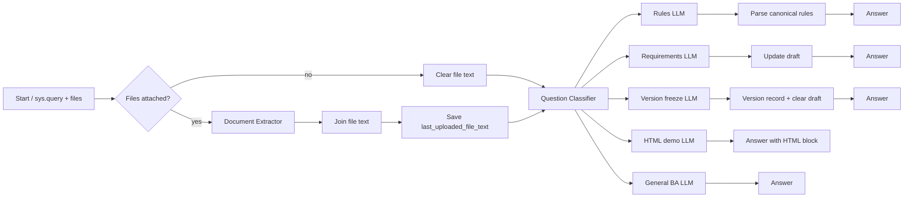

# تحلیلگر کسب‌وکار (Dify Chatflow)

## Import

1. Dify Studio → **Create App** → **Import DSL**
2. Select `business-analyst-fa-chatflow.dify.yml`
3. After import, confirm every **LLM** and **Question Classifier** uses **OpenRouter → gpt-5.6-sol-pro** (no “Incompatible” badge). Re-select from the dropdown if needed.
4. If import shows **DSL version difference**, confirm import — that warning is expected when YAML `version` and server differ slightly.
5. Publish and chat — no Knowledge Base or env vars required; **OpenRouter** must be configured under Model Provider

Built-in default **org hard rules** apply until you upload your standards file.

## End-to-end flow

## Conversation memory (per chat)

| Variable | Purpose |
|----------|---------|
| `org_hard_rules` | Mandatory integration/UI/login standards |
| `draft_requirements` | Working set until version is frozen |
| `current_version_number` | Last frozen version index |
| `version_records` | Archive of frozen versions (markdown FA) |
| `project_title` | Optional project name |
| `last_uploaded_file_text` | Text from files in the current turn |

## User intents (Farsi examples)

| Intent | Example |
|--------|---------|
| Rules | «استاندارد فرم و SSO را از فایل بخوان» |
| Requirement | «ثبت کن: کاربر بتواند درخواست مرخصی ثبت کند» |
| Freeze version | «نسخه را قطع کن» / «freeze» |
| HTML demo | «نمونه HTML با داده دمو بساز» |
| BA dialogue | Clarifications, challenges, scope questions |

## Versioning policy (enforced in prompts)

- Changes accumulate in **draft** during an RFP cycle
- **Freeze** produces an immutable version document and clears the draft for the next cycle
- HTML demo uses draft + rules (+ optional uploaded RFP text)

## Model note

DSL references **OpenRouter** `gpt-5.6-sol-pro`. Swap model in all LLM + classifier nodes if you prefer another OpenRouter model (e.g. `gpt-4o`).
